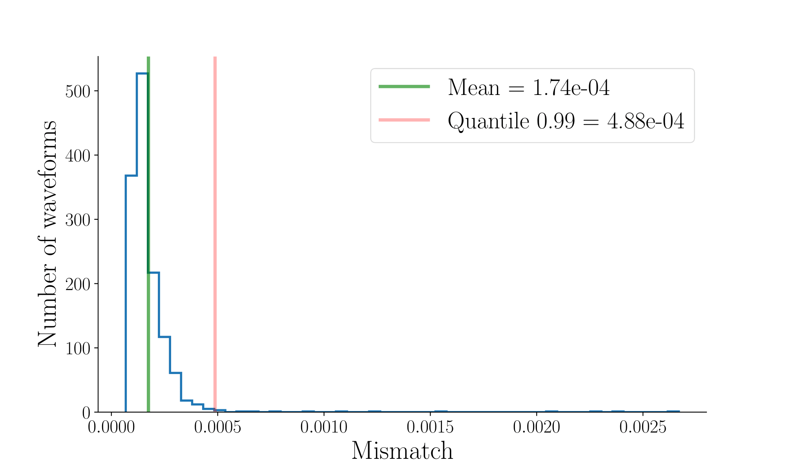
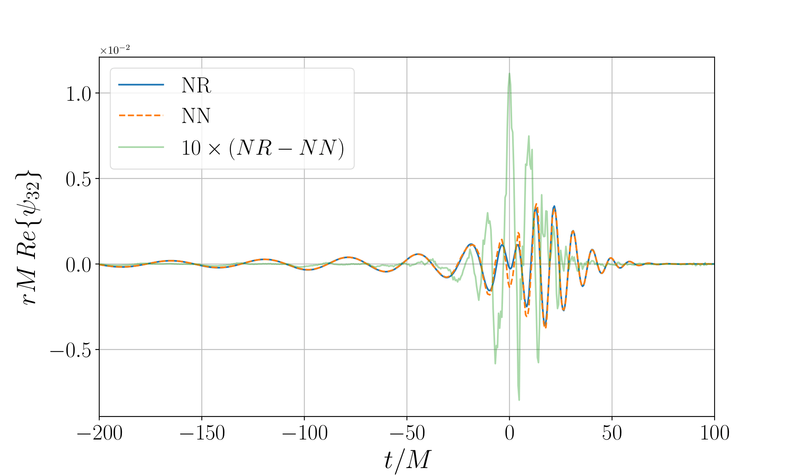

# **Waveform AnomaLy DetectOr (WALDO)**

WALDO is a *deep learning* data quality tool developed to flag possible anomalous Gravitational Waves (GW) from Numerical Relativity (NR) catalogs.
We use a U-Net architecture to learn the waveform features of a dataset. These waveforms are timeseries $h_{lm}(t)$ of modes $(l,m)$ from the spin-weighted spherical harmonics decomposition of the GW strain $h(t,\vec x)$,

$$h_{lm}(t) = \int d\Omega h(t, \vec x)\_{-2}Y_{lm}(\theta, \phi) .$$ 

WALDO computes the mismatch between $h_{lm}(t)$ and its prediction $\bar h_{lm}(t)$ to compose a histogram. We can identify anomalous waveforms by isolating 1% of the highest measurement values. Below, the anomaly search associated with the radiation field $\psi_{32} = \ddot h_{32}$ from the [dataset](https://github.com/tiberioap/waldo/blob/main/simulations_ID.txt). Test.

  
   

___

The project is composed of three main [codes](https://github.com/tiberioap/waldo/tree/main/waldo):
* **wfdset.py:** for pre-processing NR dataset;
* **unet.py:** the neural network;
* **waldo.py:** for mismatch evaluation and anomaly search.

Check the tutorials in [docs](https://github.com/tiberioap/waldo/tree/main/docs).
